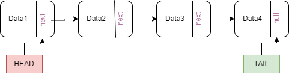
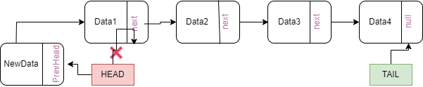
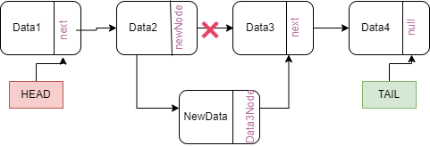
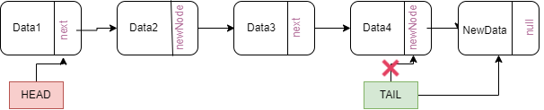
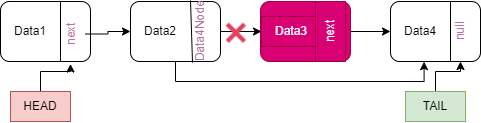

# Linked List

> **_INFO:_**  Linked List is a linear data structure. 
> + Linked list consists of nodes. Node -> Node -> Node.
> + Elements are not stored at contiguous location, pointers are used for linking nodes.

## Singly Linked List

> **_INFO:_** A node of Singly Linked List stores the data and the address of the next node.

### Insertion

Usually you can insert a new element one of three ways:

+ At the beginning of Linked List;

  

+ After given Node;

  

+ At the end of Linked List;

  

### Deleting

  

### Traversing 

Could be done only in one direction.

## Doubly Linked List

> **_INFO:_**  Doubly Linked List (DLL).
> + DDL consists of nodes. Node -> Node -> Node.
> + Elements are not stored at contiguous location, pointers are used for linking nodes.
> + Each Node contains data, a reference to prev node and a reference to next node.

### Applications of Doubly Linked List:

+ Doubly linked list can be used in navigation systems where both forward and backward traversal is required.
+ It can be used to implement different tree data structures.
+ It can be used to implement undo/redo operations. 

### Real-Time Applications of Doubly Linked List:

+ Doubly linked lists are used in web page navigation in both forward and backward directions.
+ It can be used in games like a deck of cards.

### Advantages of Doubly Linked List:

+ The doubly linked list allows traversing in both forward and backward directions.
+ Deletion of the nodes can be done easily.
+ Reversing of linked list is easy.
+ Insertion can be performed efficiently at any node.

### Disadvantages of Doubly Linked List:

+ In a doubly-linked list, each node has an extra pointer which requires extra space.
+ Doubly linked list operations require more pointers to be handled hence, more time.
+ Random access to elements is not allowed.

## Circular Linked List

> NOTE: Circular linked list is a linked list where all nodes are connected to form a circle. There is no NULL at the end. A circular linked list can be a singly circular linked list or doubly circular linked list.

### Advantages of Circular Linked Lists:

+ Any node can be a starting point. We can traverse the whole list by starting from any point. We just need to stop when the first visited node is visited again.
+ Useful for implementation of queue. Unlike this implementation, we don’t need to maintain two pointers for front and rear if we use circular linked list. 
+ We can maintain a pointer to the last inserted node and front can always be obtained as next of last.
+ Circular lists are useful in applications to repeatedly go around the list. For example, when multiple applications are running on a PC, it is common for the operating system to put the running applications on a list and then to cycle through them, giving each of them a slice of time to execute, and then making them wait while the CPU is given to another application. 
+ It is convenient for the operating system to use a circular list so that when it reaches the end of the list it can cycle around to the front of the list.
+ Circular Doubly Linked Lists are used for implementation of advanced data structures like Fibonacci Heap.
