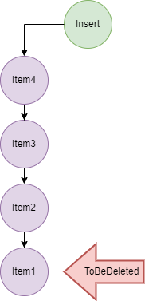

# Queue

> INFO: Data Structure stores data in a particular order. General rule is FIFO: First In First Out.
> The elements are inserted at the end of the list, and are deleted from the beginning of the list.

Putting items in the queue is called **enqueue**, and removing items from the queue is called **dequeue**.

## Basic Operations of Queue

+ Enqueue: Add an element to the end of the queue
+ Dequeue: Remove an element from the front of the queue
+ IsEmpty: Check if the queue is empty
+ IsFull: Check if the queue is full
+ Peek: Get the value of the front of the queue without removing it

> INFO: Queue contains two pointers FRONT (track the first element of the queue) and REAR (track the first element of the queue).

## Queue implementations

+ Array
+ Linked List

## Types of Queues

+ Simple Queue (described above)
+ Circular Queue: the last element is connected to the first element
+ Priority Queue: arranges the elements in a queue based on some priority
+ Dequeue/Double Ended Queue: an element can be inserted or removed from both the ends of the queue unlike the other queues in which it can be done only from one end. Because of this property it may not obey the First In First Out property.

## Applications of Queue

+ CPU scheduling, Disk Scheduling
+ When data is transferred asynchronously between two processes.The queue is used for synchronization. For example: IO Buffers, pipes, file IO, etc
+ Handling of interrupts in real-time systems.
+ Call Center phone systems use Queues to hold people calling them in order.

## Advantages of Queue:

+ A large amount of data can be managed efficiently with ease.
+ Operations such as insertion and deletion can be performed with ease as it follows the first in first out rule.
+ Queues are useful when a particular service is used by multiple consumers.
+ Queues are fast in speed for data inter-process communication.
+ Queues can be used in the implementation of other data structures.

## Disadvantages of Queue:

+ The operations such as insertion and deletion of elements from the middle are time consuming.
+ Limited Space.
+ In a classical queue, a new element can only be inserted when the existing elements are deleted from the queue.
+ Searching an element takes O(N) time.
+ Maximum size of a queue must be defined prior.
