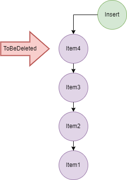

## Stack

> INFO: Data structure stores element in particular order LIFO (Last In First Out)

### Conventional operations of Stack

+ push()  - add an item to the stack  
+ pop () - remove an item from the stack
+ top() or peek() - get top element from the stack

### Implementations

+ arrays
+ linked list

### Types of Stacks:

+ **Register Stack**: This type of stack is also a memory element present in the memory unit and can handle a small amount of data only. The height of the register stack is always limited as the size of the register stack is very small compared to the memory.
+ **Memory Stack**: This type of stack can handle a large amount of memory data. The height of the memory stack is flexible as it occupies a large amount of memory data. 

> NOTE: It is not recommended to use Java's Stack. Author of Stack claims that more complete and consistent set of LIFO stack operations is provided by the Deque interface and its implementations, which should be used in preference to this class. 
> For example: Deque<Integer> stack = new ArrayDeque<Integer>();