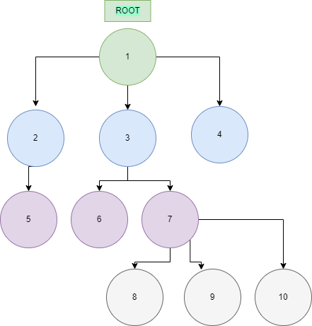
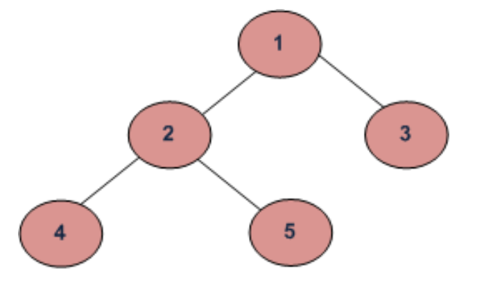

# Tree

> NOTE: A tree has hierarchy data arranged in a tree-like structure.

To put it simply, this data structure consists of a collection of nodes. 

A node stores a value (data) and a list of references to children nodes.

Terms:
+ Node 1 - root node
+ Node 2, Node 3, Node 4 - Children nodes of Node 1
+ Node 5 - Child of Node 2
+ Node 6, Node 7 - Children of Node 3
+ Node 3, Node 6, Node 7, Node 8, Node 9, Node 10 - Subtree of a Tree
+ Node 2, Node 5 - Subtree of a Tree
+ Node 4, Node 8, Node 9, Node 1 - leaf nodes (nodes which do not have any child nodes)
+ Green - level 0 of a tree
+ Blue - level 1 of a tree
+ Purple - level 2 of a tree
+ Grey - level 3 of a tree
+ Height of Node 3 - 2. Height of a node: The number of edges on the longest path from that node to a leaf.
+ Degree of a Node - a level, The height of a tree is the height of the root node i.e the count of edges from the root to the deepest node.

## Binary Tree

> NOTE:  A tree contains nodes and 2 pointers. These two pointers are the left child and the right child of the parent node. 

### Tree Traversals

Another topic to cover because trees can be traversed in different ways.

+ Depth First Traversals:
  - Inorder (Left, Root, Right) : 4 2 5 1 3
  - Preorder (Root, Left, Right) : 1 2 4 5 3
  - Postorder (Left, Right, Root) : 4 5 2 3 1
+ Breadth-First or Level Order Traversal: 1 2 3 4 5

### Main applications of trees include:

+ Manipulate hierarchical data.
+ Make information easy to search (tree traversal).
+ Manipulate sorted lists of data.
+ Router algorithms

### Applications of Binary Tree:

+ In compilers, Expression Trees are used which is an application of binary tree.
+ Huffman coding trees are used in data compression algorithms.
+ Priority Queue is another application of binary tree that is used for searching maximum or minimum in O(logN) time complexity.

### Binary Search Tree 

> INTO: A Binary Search Tree is an organized binary tree with a structured organization of nodes. Each subtree must also be of that particular structure.
> The values of left subtree of a particular node should be lesser than that node and the right subtree values should be greater.

You can check out my custom implementation of [Binary Search Tree]. I've done it before.

[Binary Search Tree]: https://github.com/vmalaya/MyBinarySearchTree/blob/master/src/BinarySearchTree.java